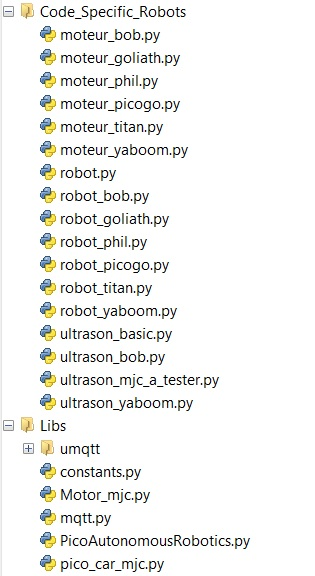
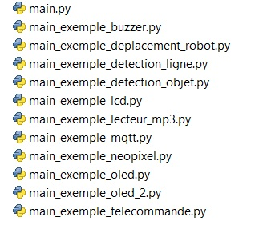
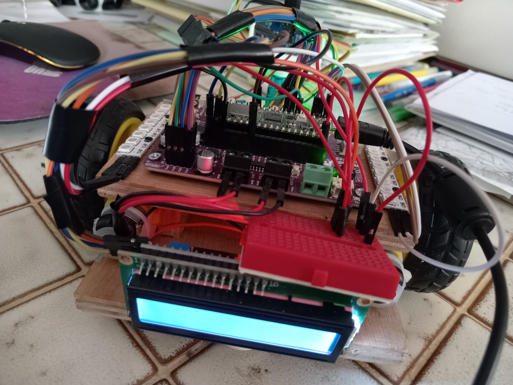
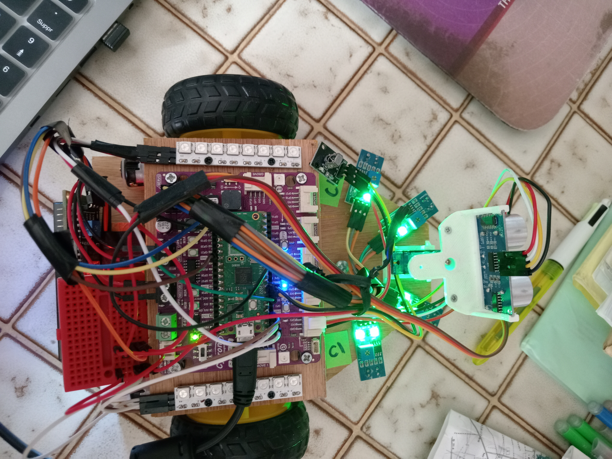

  
  

# Doc Technique

<h1 style="color: black; font-size: 52px; text-align: center;">ROBOT TITAN</h1>

<!-- Ceci est un saut de page (exportes en HTML/PDF via wkhtmltopdf) -->

<!-- --------------------------------------------------------------- -->

1 - Liste des Composants
========================

- Antoine:
  - Base Robot
  - Ultrason ?? oui car livré avec le support…
- Sebastien:
  - 2 roues + 2 moteurs
  - Plaque Cytron qui inclus un buzzer
- MJC:
  - 4 capteurs de ligne
  - IR + Telecommande
  - Pico W + Cable USB
  - 2 rubans 8LEDs Neopixel
  - Ecran LCD
  - Alim 3 piles

2 - Schéma de montage
=====================

| Module              | GPIO Nb   | Module    | GPIO Nb   |
|---------------------|-----------|-----------|-----------|
| Neopixel Gauche     | GPIO#0    | ----      | ----    |
| Neopixel Droit      | GPIO#1    | ----      | ----    |
| Ultrason Trigger    | GPIO#2    | ----      | ----    |
| Ultrason Echo       | GPIO#3    |           |  GPIO#28    |
| Servo               | GPIO#4    |           |  GPIO#27    |
| IR Telecommande     | GPIO#5    |           |  GPIO#26    |
|                     | GPIO#6    | ----      | ----    |
|                     | GPIO#7    | ----      | ----    |
| Moteur Droit IN1    | GPIO#8    | ----      | ----    |
| Moteur Droit IN2    | GPIO#9    | Buzzer Cytron     |  GPIO#22    |
| Moteur Gauche IN1   | GPIO#10   |           |  GPIO#21    |
| Moteur Gauche IN2   | GPIO#11   |           |  GPIO#20    |
| Detection ligne 1   | GPIO#12   |           |  GPIO#19    |
| Detection ligne 2   | GPIO#13   |           |  GPIO#18    |
| Detection ligne 3   | GPIO#14   |  LCD (I2C0 SCL)    |  GPIO#17    |
| Detection ligne 4   | GPIO#15   |  LCD (I2C0 SDA)    |  GPIO#16    |

3 - Code Micropython 
====================

3.1 Elements de Base
--------------------

3.2 Exemples d'utilisation
--------------------------

4 - Photos 
==========

