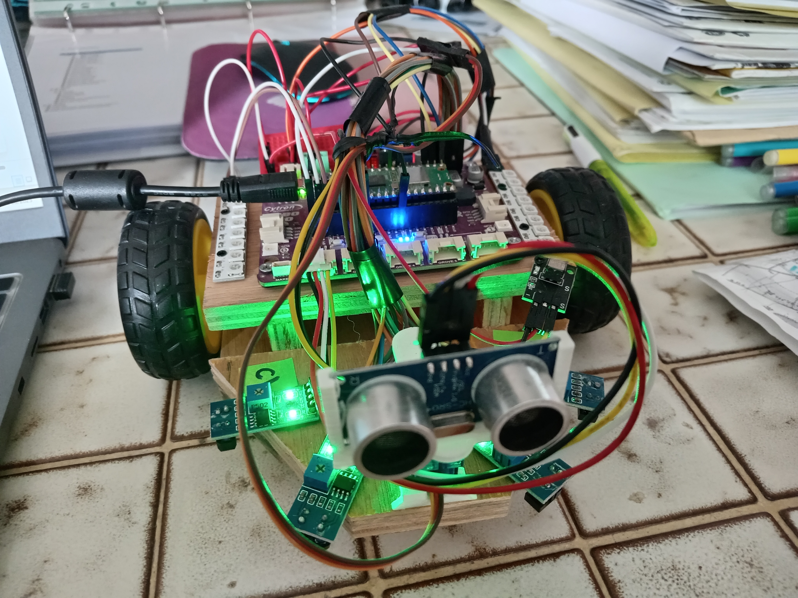
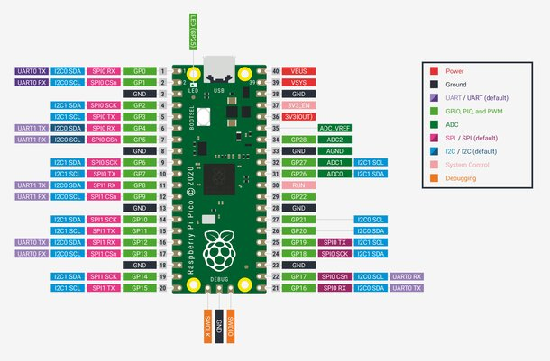

  
  

# Doc Technique

<h1 style="color: black; font-size: 52px; text-align: center;">ROBOT TITAN</h1>

<!-- Ceci est un saut de page (exportes en HTML/PDF via wkhtmltopdf) -->

<!-- --------------------------------------------------------------- -->

1 - Liste des Composants
========================

- Antoine:
  - Base Robot
  - Ultrason ?? oui car livré avec le support…
- Sebastien:
  - 2 roues + 2 moteurs
  - Plaque Cytron qui inclus un buzzer
- MJC:
  - 4 capteurs de ligne
  - IR + Telecommande
  - Pico W + Cable USB
  - 2 rubans 8LEDs Neopixel
  - Ecran LCD
  - Alim 3 piles

<!-- Ceci est un saut de page (exportes en HTML/PDF via wkhtmltopdf) -->

<!-- --------------------------------------------------------------- -->

2 - Schéma de montage
=====================

| Module | GPIO Nb | Module | GPIO Nb |
|-----------|-----------|-----------|-----------|
| Neopixel Gauche   | GPIO#0    | xxxx    | xxxx    |
| Neopixel Droit   | GPIO#1    | xxxx    | xxxx    |
| Ultrason Trigger   | GPIO#2    | xxxx    | xxxx    |
| Ultrason Echo   | GPIO#3    |      |  GPIO#    |
| Servo   | GPIO#4    |      |  GPIO#    |
| IR Telecommande   | GPIO#5    |      |  GPIO#    |
|    | GPIO#6    |      |  GPIO#    |
|    | GPIO#7    |      |  GPIO#    |
| Moteur Droit IN1   | GPIO#8    |      |  GPIO#    |
| Moteur Droit IN2   | GPIO#9    |      |  GPIO#    |
| Moteur Droit IN2   | GPIO#9    |      |  GPIO#    |

