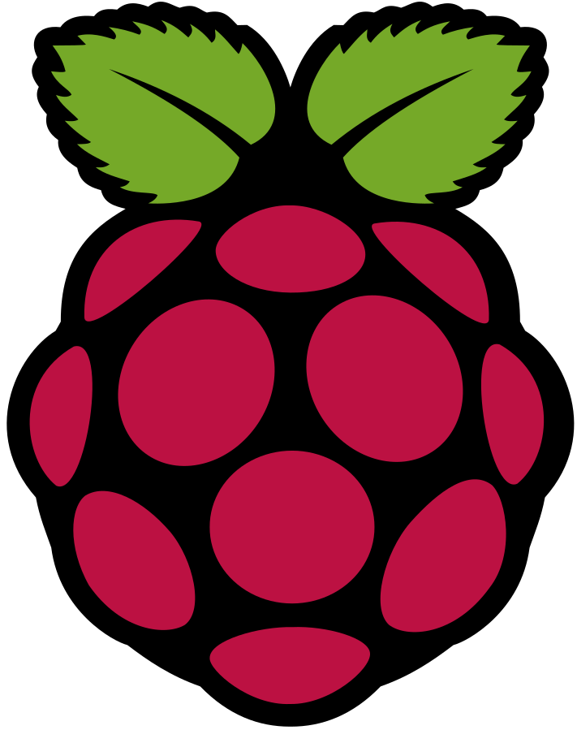
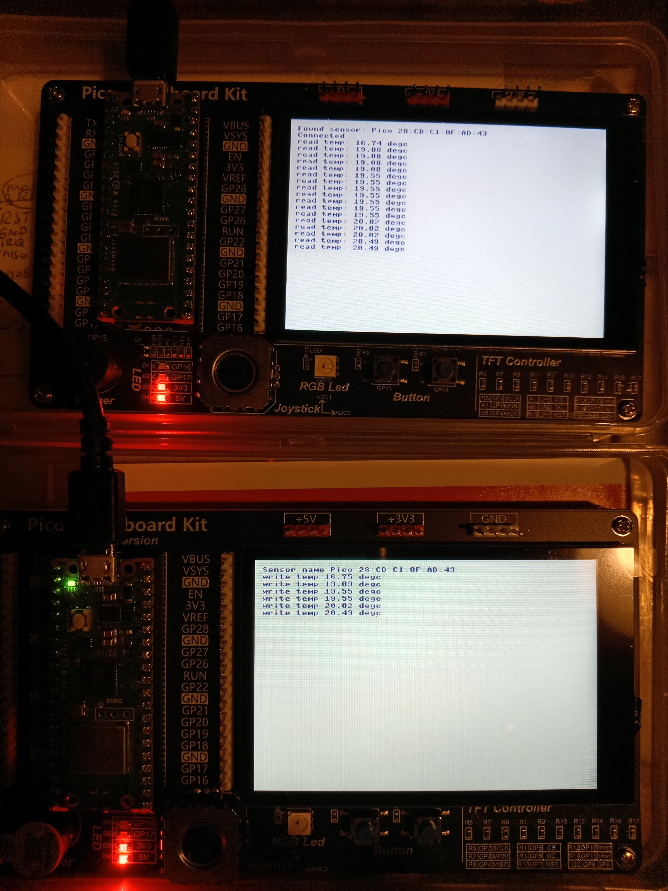
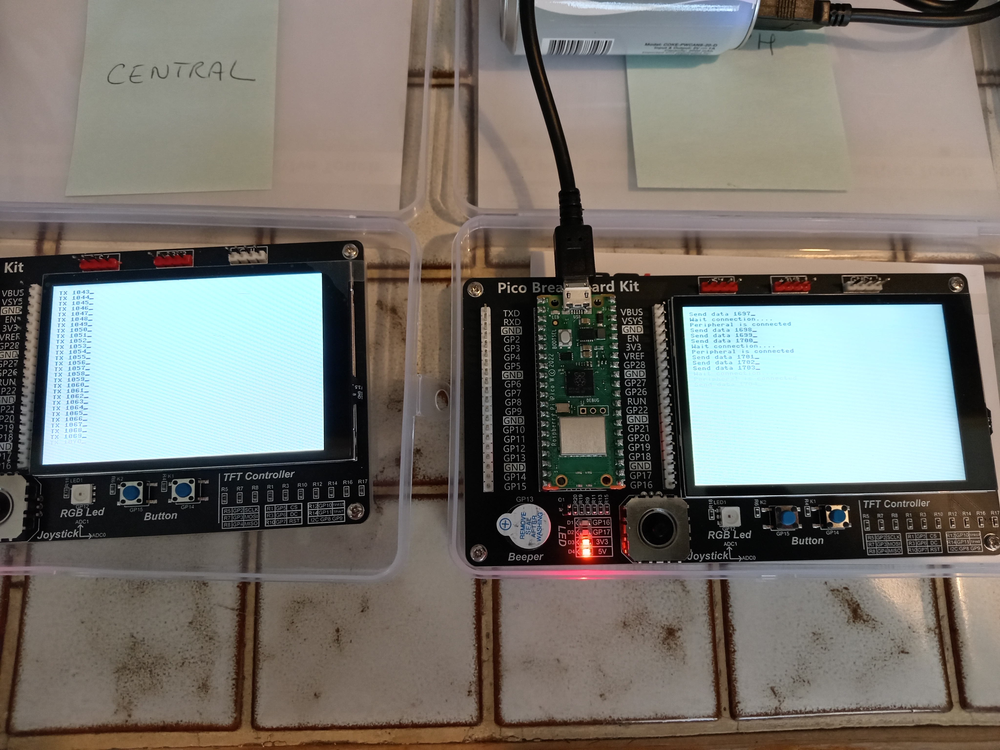

  
  

# Doc Technique

<h1 style="color: black; font-size: 52px; text-align: center; font-family: 'Verdana', sans-serif;">Telecommande Bluetooth</h1>

<!-- Ceci est un saut de page (exportes en HTML/PDF via wkhtmltopdf) -->

<!-- --------------------------------------------------------------- -->

# 1 - Presentation

- Pico Wifi 1: 
  - Micropython
  - Telecommande
  - Envoi des commandes
  - Recupere des status
- Pico Wifi 2: 
  - SDK 
  - Objet piloté: Exple Robot, Bras articulé
  - Recois des commandes
  - Envoie des infos

- Bluetooth: Transfer de data ou de chaine de caracteres
- Ecran TFT: 
  - Creation de boutons "touch"
  - Affichage widgets: status...

<!-- Ceci est un saut de page (exportes en HTML/PDF via wkhtmltopdf) -->

<!-- --------------------------------------------------------------- -->

# 2 - Liste des Composants

- 2x Pico Breadboard Kit 
  - Ecran TFT
  - Buzzer
  - Joystick
  - 2x LEDs
  - RGB LED
  - 2x Boutons
- 2x Pico Wifi  

<!-- Ceci est un saut de page (exportes en HTML/PDF via wkhtmltopdf) -->

<!-- --------------------------------------------------------------- -->

# 3 - Schéma de montage

| Module                         | GPIO Nb   | Module            | GPIO Nb  |
|--------------------------------|-----------|-------------------|----------|
|                                | GPIO#0    | ----              | ----     |
|                                | GPIO#1    | ----              | ----     |
| 3.5 TFT Screen SCK (SPI0)      | GPIO#2    | ----              | ----     |
| 3.5 TFT Screen DIN-MOSI (SPI0) | GPIO#3    |                   | GPIO#28  |
| MISO Rx                        | GPIO#4    | Joystick Y (ADC1) | GPIO#27  |
| 3.5 TFT Screen CS (SPI0)       | GPIO#5    | Joystick X (ADC0) | GPIO#26  |
| 3.5 TFT Screen DC (SPI0)       | GPIO#6    | ----              | ----     |
| 3.5 TFT Screen RST (SPI0)      | GPIO#7    | ----              | ----     |
| Capacitive Touch Screen SDA    | GPIO#8    | ----              | ----     |
| Capacitive Touch Screen SCL    | GPIO#9    | Buzzer            | GPIO#22  |
| TPRST ?                        | GPIO#10   |                   | GPIO#21  |
| TPINP ?                        | GPIO#11   |                   | GPIO#20  |
| RGB LED WS2818 Neopixel        | GPIO#12   |                   | GPIO#19  |
| Buzzer                         | GPIO#13   |                   | GPIO#18  |
| Bouton 1                       | GPIO#14   |  LED 2            | GPIO#17  |
| Bouton 2                       | GPIO#15   |  LED 1            | GPIO#16  |

<!-- Ceci est un saut de page (exportes en HTML/PDF via wkhtmltopdf) -->

<!-- --------------------------------------------------------------- -->

# 4 - Code Micropython 

# 5 - Photos 

